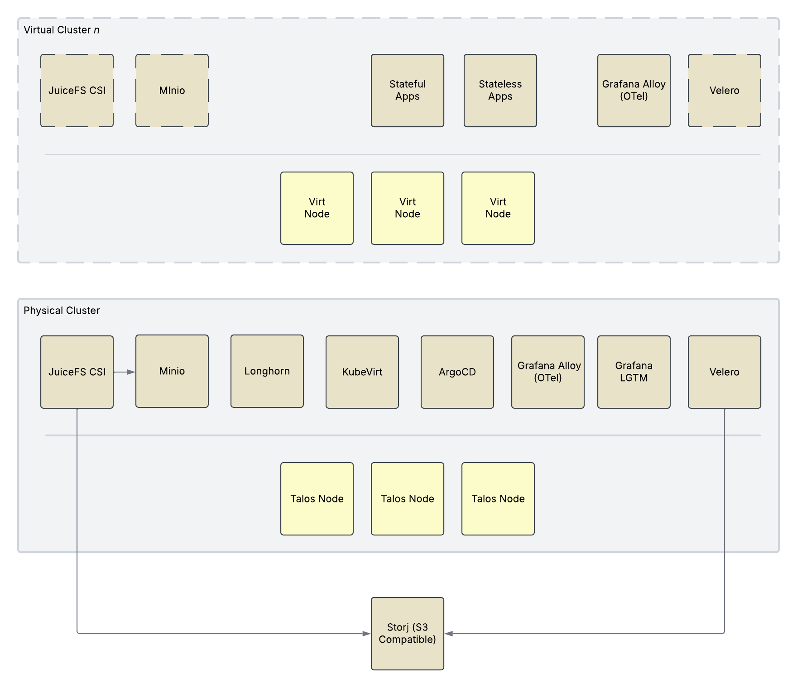

## Preamble

Home labs are quite common among tech people but I've never really felt the need until recently. As an engineer working
on cloud infrastructure, the cloud has been my playground. In work I have quite a lot of freedom to explore and experiment with new technologies.

I've got a new solar installation coming up and there are some automation activities that I'd like explore using 
[HomeAssistant](https://www.home-assistant.io/). Additionally, it would be nice to have somewhere to explore new 
technologies that don't make sense in my work environment.

Recently I skimmed a YouTube video that suggested a home lab being a great way of showcasing your skills to potential
employers, and a decent portfolio of work is definitely something I'm lacking.

## Technologies

These choices are largely based on what I know already but with some new pieces in areas I'm less familiar with. The 
whole point of the experimental clusters is to try out new things and develop it over time. This is just the starting
point, based on my initial research of what makes sense for this particular setup.

* **Operating System** - Talos
* **Kubernetes** - Talos
* **Virtualisation** - Qemu/Libvirt and KubeVirt
* **Networking** - Cilium CNI, CoreDNS, Tailscale, CloudFlare
* **Storage** - Minio/JuceFS
* **Monitoring** - OpenTelemetry / Grafana LGTM stack
* **Backups** - Velero
* **Management** - ClusterAPI / ArgoCD


The code for this setup can be found in my [homelab repository](https://github.com/jsmcnair/homelab)


## Hardware

Whilst most of what I want to do can probably be done on a single machine, the production system needs to be running all the time so I will need some dedicated hardware. It's not business critical, but I will treat it as such in terms of design and operation, for academic purposes.

In a typical production environment there would normally be multiple availability zones designed into the system at the appropriate level for the environment, and services would be designed to be resilient to failure. For obvious reasons I can't replicate this environment at home, but I can simulate it to some extent.

What I want to do is have an infrastructure layer that essentially gives me a chunk of compute power that I can deploy  clusters onto. Using the plethora of tools available to me I can simulate production environments with conditions such  as geographic distribution, and start to inject faults to see how highly available services cope with them.

For this hardware I have the following requirements:

* **Low power consumption** - I'm quite keen on saving energy and I don't expect services to have a high demand.
* **Low noise** - I don't want to hear the servers running.
* **Scalable** - If I need more compute power I should be able to easily add more.
* **Virtualisation** - I want to be able to run multiple VMs on the hardware.

Something like a Raspberry Pi would be ideal, and I'll need a few of them to support the requirements of services running at the infrastructure layer. I don't plan to use this system as a NAS device, so the storage requirements are minimal, but a uniform-sized SSD attached to each node will be ideal.

## Clusters

A Kubernetes cluster will run at the infrastructure layer. This infrastructure layer will provide storage and virtualisation services that are used by the other clusters. Using Kubernetes allows me to easily manage this layer  like I would with any other cluster - using Infrastructure as Code (IaC), more specifically the GitOps pattern. 

There needs to be a production cluster that is always running. This will be running HomeAssistant and any other  household and personal services I may want to run, such as PiHole.

Lastly, I need to be able to create any number of experimental clusters for various purposes. These can be ephemeral in nature, but crucially they need to not impact the production cluster. I plan to use QoS to ensure that the production cluster is guaranteed resource and the experimental clusters are the first to be evicted.

Having the abiliy to create multiple clusters allows me to:
* optimise the use of available hardware,
* create development versions of the production cluster to test changes before deploying them,
* experiment with clusters in a way that might impact services running on them, without affecting the services I need.

## Networking

The physical network will be a simple Gigabit switch under my desk, not quite the network fabric available to me in the cloud, but it'll do! I don't currently plan to do any multi-homing or VLANs to separate the homelab from the rest of  the house. The Kubernetes pods and services will be isolated within the cluster network, and the only way to access them from outside a cluster is to deliberately expose them.

Normally I would use the cloud provider's load balancer integration with a few annotations on the ingress controller's  service. I would like to load balance traffic evenly across nodes in a cluster. Unfortunatly I think this is going to be quite difficult to acheieve in a traditional way without some significant changes to my home network to support BGP. Instead I can use the [Tailscale Kubernetes operator](https://tailscale.com/kb/1236/kubernetes-operator) which has  various options to expose services to my existing [Tailscale](https://tailscale.com/) network.

## Storage

When working with cloud providers I'm used to storage backed by the provider, made available to services via CSI and  PersistentVolumeClaims. Since I'm providing the infrastructure myself I will need services at the infrastructure layer to fill this gap.

I want to pool the available storage on the hardware, with replication enabled so that it is resilient to failure (or me breaking sh*t). A lot of the services I've deployed also make use of object storage too. I did look into Rook/Ceph but the architecture is quite complex and I would have to wrangle with resource tuning quite a bit to get it working in a minimal environment. Instead I'm giving a nod to JuceFS, backed by MiniIO. This gives me object storage for the truly cloud-native service, and PersistentVolumes for the rest. Since JuceFS supports read/write from mutliple pods I can also use it for shared storage between pods that need it.

## Backups

In cluster I use Velero to back up resources and persistent volumes. Resource backups are not technically required since the GitOps approach defines all configuration needed to deploy applications repeatably. I keep the resources as anyway because it can simplify restores and is just an extra layer of protection.

The persistent volume backups are great for point-in-time snapshot restores, but in this setup they are not adeqate because the storage and compute are all integrated. The storage at the infrastructure layer needs its own backup,  somewhere off-site. For that I will use a cloud provider's object storage service.


In a future post I plan to cover the development tooling that will form the GitOps process for managing this setup. All configuration will be avalable in a public repository, with the exception of any secrets or personally identifiable information.


## Management

As far as possible, I want everything to be managed in code. This gives me a mostly self-documenting environment that is repeatable, testable and fully automated. I'll add these capabilities as I go along, but to start with I will need ArgoCD for the GitOps approach to deployment.

I've not used ClusterAPI before so would like to give it a try. It may be possible for me to avoid terraform completely in this environment. Any infrastructure I need for clusters can be defined via ClusterAPI, and if I need to create other infrastructure for application dependencies I can use Crossplane or a custom operator.

